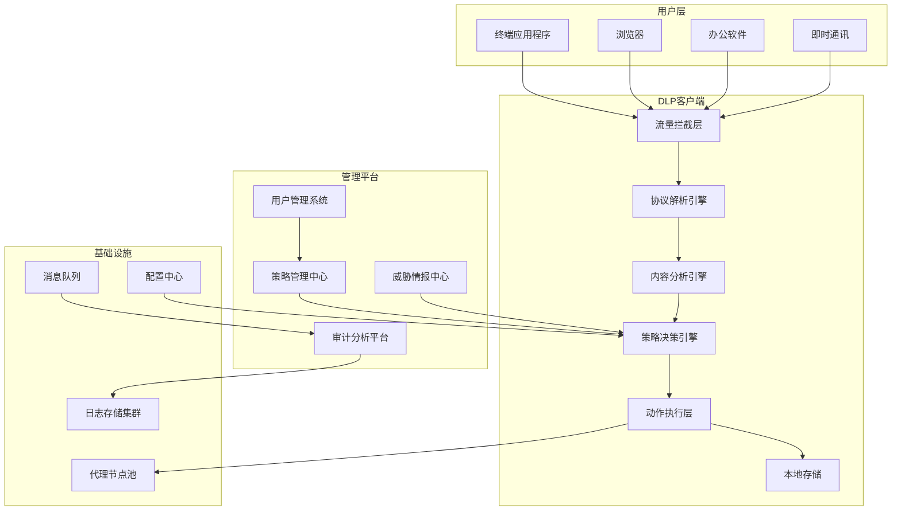
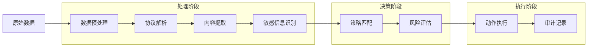
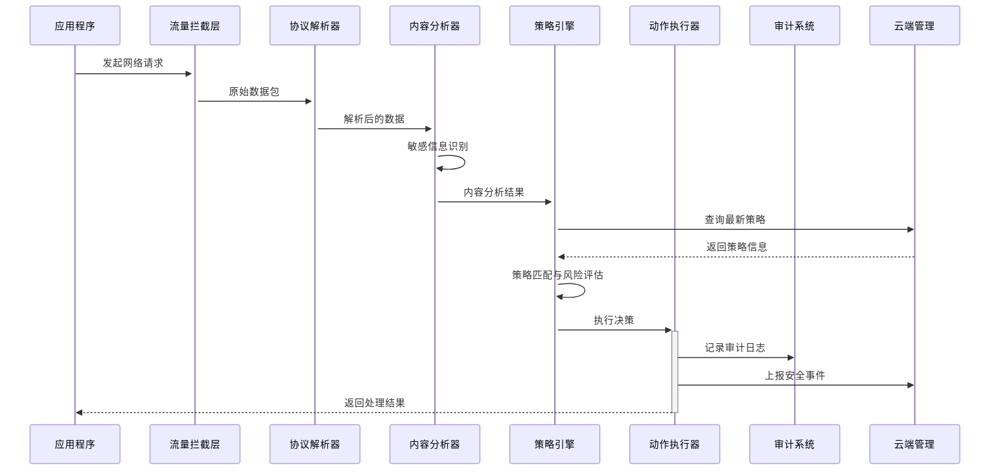

# 终端数据防泄漏(DLP)系统设计文档

## 文档信息
- **版本**: v2.0
- **创建日期**: 2024年
- **最后更新**: 2024年
- **文档状态**: 设计阶段
- **负责人**: 开发团队

## 目录
1. [项目概述](#1-项目概述)
2. [需求分析](#2-需求分析)
3. [系统架构设计](#3-系统架构设计)
4. [核心模块设计](#4-核心模块设计)
5. [安全设计](#5-安全设计)
6. [性能优化](#6-性能优化)
7. [部署方案](#7-部署方案)
8. [运维管理](#8-运维管理)
9. [测试验证](#9-测试验证)
10. [风险评估](#10-风险评估)
11. [合规性设计](#11-合规性设计)
12. [附录](#12-附录)

---

## 1. 项目概述

### 1.1 项目背景
随着企业数字化转型的深入，数据安全威胁日益严峻。终端设备作为数据流转的关键节点，面临着内部泄露、外部攻击等多重风险。本项目旨在构建一套完整的终端数据防泄漏系统，实现对敏感数据的全生命周期保护。

### 1.2 项目目标
- **数据识别**: 自动识别和分类敏感数据，支持多种数据格式和内容类型
- **行为监控**: 实时监控数据访问和传输行为，覆盖网络、文件、应用等多个维度
- **风险控制**: 基于策略的自动化风险控制，支持阻断、告警、审计等多种响应方式
- **合规审计**: 满足法规要求的审计追溯能力，确保数据处理的合规性

### 1.3 核心特性
- 🔒 **零信任架构**: 默认拒绝，基于策略的精细化控制
- 🚀 **高性能处理**: 支持Gbps级别的流量处理能力
- 🔧 **插件化设计**: 模块化架构，支持功能扩展和定制化开发
- 🌐 **跨平台支持**: Windows、macOS、Linux全平台覆盖
- 📊 **智能分析**: 基于机器学习的异常行为检测和威胁识别
- 🛡️ **多层防护**: 网络层、应用层、文件层的全方位防护
- ⚡ **实时响应**: 毫秒级的威胁检测和响应能力

### 1.4 应用场景
- **企业内网安全**: 防止敏感数据通过网络渠道泄露
- **终端设备管控**: 控制USB、打印机等外设的数据传输
- **应用行为监控**: 监控办公软件、浏览器等应用的数据操作
- **合规性审计**: 满足GDPR、等保等法规要求的审计需求

---

## 2. 需求分析

### 2.1 功能需求

#### 2.1.1 数据识别与分类
- **内容识别**:
  - 支持文档(DOC/DOCX/PDF/TXT)、图片(JPG/PNG/BMP)、代码文件等多种格式
  - 支持压缩包内容的递归扫描
  - 支持加密文件的解密分析(在授权情况下)
- **敏感信息检测**:
  - 身份证号、银行卡号、手机号等PII信息
  - 企业内部编号、项目代码等自定义敏感信息
  - 基于正则表达式和机器学习模型的智能识别
- **数据分级**:
  - 公开、内部、机密、绝密四级分类体系
  - 支持自定义分级标准和标签体系
  - 基于内容、来源、用户等多维度的自动分级

#### 2.1.2 行为监控
- **网络流量监控**:
  - HTTP/HTTPS、FTP、SMTP/POP3/IMAP、SSH等协议
  - 支持深度包检测(DPI)和流量重组
  - 实时流量分析和异常检测
- **文件操作审计**:
  - 文件的创建、修改、删除、复制、移动操作
  - 文件权限变更和共享操作
  - 支持文件指纹和版本追踪
- **应用行为监控**:
  - 浏览器下载、上传行为
  - 办公软件的文档操作
  - 即时通讯工具的文件传输
  - 云盘同步和邮件发送行为
- **外设控制**:
  - USB存储设备的读写控制
  - 打印机的打印内容监控
  - 蓝牙设备的数据传输控制
  - 光驱和软驱的访问控制

#### 2.1.3 策略管理
- **分级策略**:
  - 支持全局、部门、用户三级策略体系
  - 策略继承和覆盖机制
  - 策略优先级和冲突解决
- **动态更新**:
  - 策略热更新，无需重启服务
  - 版本控制和回滚机制
  - 策略变更的审计追踪
- **条件匹配**:
  - 基于用户身份、角色、部门的条件匹配
  - 基于时间、地点、网络环境的条件匹配
  - 基于设备类型、应用程序的条件匹配
- **动作执行**:
  - 阻断: 完全禁止操作
  - 告警: 发送通知但允许操作
  - 审计: 记录详细日志
  - 加密: 强制加密传输或存储
  - 水印: 添加数字水印标识

### 2.2 非功能需求

#### 2.2.1 性能要求
- **吞吐量**: 支持10Gbps网络流量处理，满足高速网络环境需求
- **延迟**: 网络延迟增加不超过5ms，确保用户体验不受影响
- **并发**: 支持10万并发连接，满足大型企业的并发需求
- **资源占用**:
  - 内存占用不超过512MB
  - CPU占用率在正常负载下不超过10%
  - 磁盘I/O优化，避免影响系统性能

#### 2.2.2 可靠性要求
- **可用性**: 99.9%系统可用性，年停机时间不超过8.76小时
- **故障恢复**: 30秒内自动故障恢复，支持热备和故障转移
- **数据完整性**: 审计日志零丢失，支持数据校验和恢复
- **容错能力**:
  - 单点故障不影响整体功能
  - 支持降级运行模式
  - 异常情况下的安全失效机制

#### 2.2.3 安全要求
- **数据加密**:
  - 传输数据使用TLS 1.3加密
  - 存储数据使用AES-256加密
  - 密钥管理和轮换机制
- **身份认证**:
  - 支持多因子身份认证(MFA)
  - 集成企业AD/LDAP系统
  - 支持证书认证和生物识别
- **权限控制**:
  - 基于角色的访问控制(RBAC)
  - 最小权限原则
  - 权限审计和定期评估
- **审计追溯**:
  - 完整的操作审计链
  - 不可篡改的日志记录
  - 支持法务取证要求

#### 2.2.4 可扩展性要求
- **水平扩展**: 支持集群部署和负载均衡
- **垂直扩展**: 支持硬件资源的动态调整
- **功能扩展**: 插件化架构支持功能模块的动态加载
- **协议扩展**: 支持新协议和数据格式的快速适配

---

## 3. 系统架构设计

### 3.1 整体架构设计

#### 3.1.1 分层架构图


#### 3.1.2 插件化架构设计
```go
// 插件接口定义
type DLPPlugin interface {
    // 插件基本信息
    Name() string
    Version() string
    Description() string
    Dependencies() []string

    // 生命周期管理
    Initialize(config PluginConfig) error
    Start() error
    Stop() error
    Cleanup() error
    HealthCheck() error

    // 功能接口
    ProcessData(data *DataContext) (*ProcessResult, error)
    GetMetrics() map[string]interface{}
    UpdateConfig(config PluginConfig) error

    // 事件处理
    OnEvent(event *PluginEvent) error
}

// 插件管理器
type PluginManager struct {
    plugins     map[string]DLPPlugin
    config      *PluginManagerConfig
    logger      logging.Logger
    eventBus    *EventBus
    healthCheck *HealthChecker
}

func (pm *PluginManager) LoadPlugin(path string) error {
    // 插件安全检查
    if err := pm.validatePlugin(path); err != nil {
        return fmt.Errorf("plugin validation failed: %w", err)
    }

    // 动态加载插件
    plugin, err := plugin.Open(path)
    if err != nil {
        return fmt.Errorf("failed to open plugin: %w", err)
    }

    // 获取插件实例
    symbol, err := plugin.Lookup("NewPlugin")
    if err != nil {
        return fmt.Errorf("plugin entry point not found: %w", err)
    }

    newPlugin := symbol.(func() DLPPlugin)
    dlpPlugin := newPlugin()

    // 检查依赖
    if err := pm.checkDependencies(dlpPlugin); err != nil {
        return fmt.Errorf("dependency check failed: %w", err)
    }

    // 注册插件
    pm.plugins[dlpPlugin.Name()] = dlpPlugin

    // 初始化插件
    pluginConfig := pm.config.GetPluginConfig(dlpPlugin.Name())
    if err := dlpPlugin.Initialize(pluginConfig); err != nil {
        delete(pm.plugins, dlpPlugin.Name())
        return fmt.Errorf("plugin initialization failed: %w", err)
    }

    // 启动健康检查
    pm.healthCheck.AddPlugin(dlpPlugin)

    pm.logger.Info("Plugin loaded successfully",
        "name", dlpPlugin.Name(),
        "version", dlpPlugin.Version())

    return nil
}
```

### 3.2 核心组件架构

#### 3.2.1 数据流处理管道


#### 3.2.2 数据流转时序图


### 3.3 技术选型

#### 3.3.1 核心技术栈
| 组件 | 技术选型 | 版本要求 | 选择理由 |
|------|----------|----------|----------|
| 开发语言 | Go | 1.21+ | 高性能、跨平台、丰富的网络库 |
| 流量拦截 | WinDivert(Windows)<br>PF(macOS)<br>Netfilter(Linux) | 最新稳定版 | 系统级流量控制能力 |
| 协议解析 | gopacket | v1.1.19+ | 成熟的包解析库 |
| TLS处理 | uTLS | v1.5+ | TLS指纹伪装能力 |
| 数据存储 | SQLite/PostgreSQL | 3.36+/13+ | 轻量级本地存储/企业级存储 |
| 缓存系统 | Redis | 7.0+ | 高性能内存缓存 |
| 消息队列 | NATS | v2.9+ | 轻量级、高性能消息传递 |
| 配置管理 | Viper | v1.15+ | 灵活的配置管理 |
| 日志系统 | 自研logging包 | - | 统一的日志接口 |
| 机器学习 | TensorFlow Lite | v2.13+ | 轻量级ML推理引擎 |
| 加密算法 | AES-256-GCM<br>ChaCha20-Poly1305 | - | 高安全性加密算法 |

#### 3.3.2 架构模式
- **插件化架构**: 支持功能模块的动态加载和卸载
- **事件驱动**: 基于事件的异步处理模式
- **管道模式**: 数据处理流水线设计
- **策略模式**: 可配置的规则引擎
- **观察者模式**: 审计和监控功能
- **工厂模式**: 跨平台组件创建
- **适配器模式**: 不同协议和格式的统一处理

---

## 4. 核心模块设计

### 4.1 流量拦截层设计

#### 4.1.1 跨平台拦截接口
```go
// 统一的流量拦截接口
type TrafficInterceptor interface {
    // 初始化拦截器
    Initialize(config InterceptorConfig) error

    // 启动流量拦截
    Start() error

    // 停止流量拦截
    Stop() error

    // 设置过滤规则
    SetFilter(filter string) error

    // 获取数据包通道
    GetPacketChannel() <-chan *PacketInfo

    // 重新注入数据包
    Reinject(packet *PacketInfo) error

    // 获取统计信息
    GetStats() InterceptorStats

    // 健康检查
    HealthCheck() error
}

// 数据包信息结构
type PacketInfo struct {
    ID          string
    Timestamp   time.Time
    Direction   PacketDirection
    Protocol    Protocol
    SourceIP    net.IP
    DestIP      net.IP
    SourcePort  uint16
    DestPort    uint16
    Payload     []byte
    Size        int
    Metadata    map[string]interface{}
    ProcessInfo *ProcessInfo
}

// 进程信息
type ProcessInfo struct {
    PID         int
    ProcessName string
    ExecutePath string
    User        string
    CommandLine string
}

// 拦截器统计信息
type InterceptorStats struct {
    PacketsProcessed uint64
    PacketsDropped   uint64
    PacketsReinject  uint64
    BytesProcessed   uint64
    ErrorCount       uint64
    LastError        error
    StartTime        time.Time
    Uptime          time.Duration
}

// 拦截器工厂
func NewTrafficInterceptor(platform string) (TrafficInterceptor, error) {
    switch platform {
    case "windows":
        return NewWinDivertInterceptor(), nil
    case "darwin":
        return NewPFInterceptor(), nil
    case "linux":
        return NewNetfilterInterceptor(), nil
    default:
        return nil, fmt.Errorf("unsupported platform: %s", platform)
    }
}
```

#### 4.1.2 Windows实现（WinDivert）
```go
type WinDivertInterceptor struct {
    handle       C.HANDLE
    filter       string
    buffer       []byte
    packetCh     chan *PacketInfo
    stopCh       chan struct{}
    stats        InterceptorStats
    logger       logging.Logger
    processCache *ProcessCache
    config       InterceptorConfig
}

func (w *WinDivertInterceptor) Initialize(config InterceptorConfig) error {
    w.config = config
    w.filter = config.Filter
    w.buffer = make([]byte, config.BufferSize)
    w.packetCh = make(chan *PacketInfo, config.ChannelSize)
    w.stopCh = make(chan struct{})
    w.logger = config.Logger
    w.processCache = NewProcessCache(config.CacheSize)

    // 打开WinDivert句柄
    handle := C.WinDivertOpen(
        C.CString(w.filter),
        C.WINDIVERT_LAYER_NETWORK,
        C.INT16(config.Priority),
        C.UINT64(config.Flags))

    if handle == C.INVALID_HANDLE_VALUE {
        return fmt.Errorf("failed to open WinDivert handle: %v", C.GetLastError())
    }

    w.handle = handle
    w.stats.StartTime = time.Now()

    // 设置队列长度和时间限制
    C.WinDivertSetParam(handle, C.WINDIVERT_PARAM_QUEUE_LEN, C.UINT64(config.QueueLen))
    C.WinDivertSetParam(handle, C.WINDIVERT_PARAM_QUEUE_TIME, C.UINT64(config.QueueTime))

    return nil
}

func (w *WinDivertInterceptor) Start() error {
    // 启动多个工作协程提高性能
    for i := 0; i < w.config.WorkerCount; i++ {
        go w.captureWorker(i)
    }

    w.logger.Info("WinDivert interceptor started",
        "workers", w.config.WorkerCount,
        "filter", w.filter)
    return nil
}

func (w *WinDivertInterceptor) captureWorker(workerID int) {
    buffer := make([]byte, w.config.BufferSize)

    for {
        select {
        case <-w.stopCh:
            return
        default:
            var recvLen C.UINT
            var addr C.WINDIVERT_ADDRESS

            ret := C.WinDivertRecv(
                w.handle,
                unsafe.Pointer(&buffer[0]),
                C.UINT(len(buffer)),
                &recvLen,
                &addr)

            if ret == 0 {
                if err := C.GetLastError(); err != C.ERROR_INSUFFICIENT_BUFFER {
                    w.stats.ErrorCount++
                    w.stats.LastError = fmt.Errorf("WinDivertRecv failed: %v", err)
                }
                continue
            }

            // 解析数据包
            packet := w.parsePacket(buffer[:recvLen], &addr, workerID)
            if packet != nil {
                atomic.AddUint64(&w.stats.PacketsProcessed, 1)
                atomic.AddUint64(&w.stats.BytesProcessed, uint64(packet.Size))

                select {
                case w.packetCh <- packet:
                case <-w.stopCh:
                    return
                default:
                    // 通道满了，丢弃数据包
                    atomic.AddUint64(&w.stats.PacketsDropped, 1)
                    w.logger.Warn("Packet channel full, dropping packet")
                }
            }
        }
    }
}

func (w *WinDivertInterceptor) parsePacket(data []byte, addr *C.WINDIVERT_ADDRESS, workerID int) *PacketInfo {
    // 解析IP头
    if len(data) < 20 {
        return nil
    }

    ipVersion := data[0] >> 4
    if ipVersion != 4 && ipVersion != 6 {
        return nil
    }

    packet := &PacketInfo{
        ID:        fmt.Sprintf("%d-%d-%d", workerID, time.Now().UnixNano(), addr.IfIdx),
        Timestamp: time.Now(),
        Payload:   make([]byte, len(data)),
        Size:      len(data),
        Metadata:  make(map[string]interface{}),
    }

    copy(packet.Payload, data)

    // 设置方向
    if addr.Outbound != 0 {
        packet.Direction = PacketDirectionOutbound
    } else {
        packet.Direction = PacketDirectionInbound
    }

    // 解析IPv4
    if ipVersion == 4 {
        packet.SourceIP = net.IP(data[12:16])
        packet.DestIP = net.IP(data[16:20])
        packet.Protocol = Protocol(data[9])

        // 解析传输层协议
        headerLen := int(data[0]&0x0F) * 4
        if headerLen >= 20 && len(data) > headerLen+4 {
            switch packet.Protocol {
            case ProtocolTCP:
                packet.SourcePort = binary.BigEndian.Uint16(data[headerLen:headerLen+2])
                packet.DestPort = binary.BigEndian.Uint16(data[headerLen+2:headerLen+4])
            case ProtocolUDP:
                packet.SourcePort = binary.BigEndian.Uint16(data[headerLen:headerLen+2])
                packet.DestPort = binary.BigEndian.Uint16(data[headerLen+2:headerLen+4])
            }
        }
    }

    // 获取进程信息
    if processInfo := w.getProcessInfo(addr); processInfo != nil {
        packet.ProcessInfo = processInfo
    }

    return packet
}

func (w *WinDivertInterceptor) getProcessInfo(addr *C.WINDIVERT_ADDRESS) *ProcessInfo {
    // 从缓存中获取进程信息
    if info := w.processCache.Get(addr.ProcessId); info != nil {
        return info
    }

    // 查询进程信息
    processInfo := &ProcessInfo{
        PID: int(addr.ProcessId),
    }

    // 获取进程名称和路径
    if handle := C.OpenProcess(C.PROCESS_QUERY_INFORMATION|C.PROCESS_VM_READ, 0, C.DWORD(addr.ProcessId)); handle != 0 {
        defer C.CloseHandle(handle)

        var buffer [C.MAX_PATH]C.WCHAR
        var size C.DWORD = C.MAX_PATH

        if C.QueryFullProcessImageNameW(handle, 0, &buffer[0], &size) != 0 {
            processInfo.ExecutePath = C.GoString((*C.char)(unsafe.Pointer(&buffer[0])))
            processInfo.ProcessName = filepath.Base(processInfo.ExecutePath)
        }
    }

    // 缓存进程信息
    w.processCache.Set(addr.ProcessId, processInfo)

    return processInfo
}
```
```
